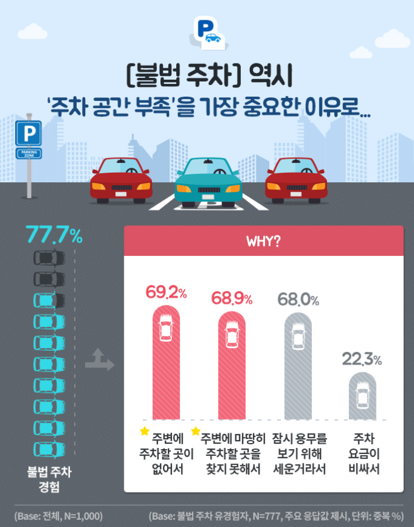

# 전국 주차장 정보 표준 데이터 대시보드

## 개발배경
 일상생활에서 흔히 볼 수 있는 불법 주차 차량들에 대한 의문점이 생겨 

 뉴스 검색을 통해 아래와 같은 설문조사 결과를 확인하였고

 

 이 설문조사가 맞는지 확인해보기 위해서 이 프로젝트를 진행하였습니다.

 

 

## 기능
 시와 구 또는 도를 선택해서 주차장 데이터에 대해서 확인 가능

 지도에 핑이 찍혀서 주차장이 어디에 있는지 확인 가능 

 유료주차장과 무료주차장을 나눠서 볼 수 있고 한번에 확인도 가능

